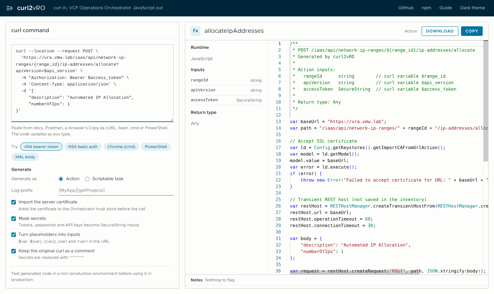

# curl2vRO Web App

Paste a curl command and get ready-to-run VCF Operations Orchestrator (vRO) JavaScript.

**Live:** https://curl2vro.vercel.app

This is the web front end for the [curl2vro](https://www.npmjs.com/package/curl2vro) npm package ([source](https://github.com/imtrinity94/Curl2vRO)).



## Features

- **Converts as you type.** The conversion runs entirely in your browser, so the curl command is never sent to a server.
- **Reads curl the way people paste it.** It handles bash `\` line breaks (including trailing spaces), Windows cmd `^` (Chrome's "Copy as cURL (cmd)"), PowerShell `` ` `` and `curl.exe`, smart quotes copied from docs, and Postman-style placeholders.
- **Skips options vRO can't use instead of failing.** `-v`, `-s`, `-o` and `--compressed` are dropped. Unknown options, `-F` uploads and proxies are listed in the notes panel.
- **Generates as an action or a scriptable task.** The inputs and the return type or output appear in the side panel.
- **Masks secrets.** Bearer tokens, `-u` passwords, API-key headers and password, secret or token fields become `SecureString` inputs, and are blanked out in the curl comment.
- **Turns placeholders into inputs.** `$var`, `${var}`, `{{var}}`, `{var}` and `<var>` in the URL become camelCase inputs.
- **Has optional extras:** the certificate import block, a `System.log` prefix, and the original curl kept as a comment.
- **Outputs plain ES5.1 JavaScript** that works on Rhino in vRO 8.x and 9.x.
- **Lets you copy the code or download it as a `.js` file.** The suggested action name follows camelCase verbObject.
- **Has a light and dark theme** and works on mobile.

## How it works

```
public/index.html            UI (Monaco editor, loaded from jsdelivr)
public/engine/               curl2vro browser engine, copied from the npm package
  curl2vro.browser.mjs       parser + vRO code generator
  tree-sitter.wasm           bash grammar (WebAssembly) used to parse curl
  tree-sitter-bash.wasm
server.js                    Express: serves public/ and the optional API
scripts/copy-engine.js       copies the engine from node_modules/curl2vro/dist on npm install
vercel.json                  Vercel routing (static page + engine + /api)
Dockerfile, render.yaml      container deploy (Render or any Docker host)
```

`npm install` runs `scripts/copy-engine.js` automatically, so `public/engine` always matches the installed curl2vro version. The engine files are committed too, because Vercel serves `public/` directly.

## Run locally

Requires Node.js 18 or later.

```bash
npm install
npm start
```

Open http://localhost:3000.

## Updating the converter

When a new curl2vro version is published:

```bash
npm install curl2vro@latest
git add package.json package-lock.json public/engine
git commit -m "Update curl2vro"
git push
```

Vercel redeploys on push.

## API

The page doesn't need the server, but the endpoint is kept for scripts and other tools.

```http
POST /api/convert
Content-Type: application/json

{
  "curlCommand": "curl -k -u admin:secret https://nsx.vmw.lab/api/v1/logical-ports",
  "options": {
    "mode": "action",
    "trustCertificate": true,
    "maskSecrets": true,
    "variablesAsInputs": true,
    "includeCurlComment": true,
    "logPrefix": ""
  }
}
```

The response looks like this:

```json
{ "success": true, "result": "/** ... vRO code ... */", "inputs": [], "warnings": [], "notes": [] }
```

`options` is optional. `mode` can be `action` or `task`. `GET /health` returns `{ "status": "ok" }`. The older `POST /convert` path still works.

## Deploy

- **Vercel (current):** connect the repo. `vercel.json` handles routing.
- **Docker / Render:** `docker build -t curl2vro-web . && docker run -p 3000:3000 curl2vro-web`, or use `render.yaml`.

## Important notice

**Disclaimer**: The generated vRO (VCF Operations Orchestrator) code must be tested thoroughly in a non-production environment before it is used in production.

The developers and maintainers of this code are not responsible for any issues, damages or losses that may occur from its use. The implementing party is responsible for:

1. Testing all functionality in a controlled environment
2. Verifying compatibility with existing systems
3. Ensuring proper error handling and validation
4. Putting backup and rollback procedures in place

By using the generated code, you acknowledge that you have read and understood this disclaimer, and you accept full responsibility for deploying and operating it in your environment.

## Author

Mayank Goyal · [cloudblogger.co.in](https://cloudblogger.co.in)

## License

MIT
